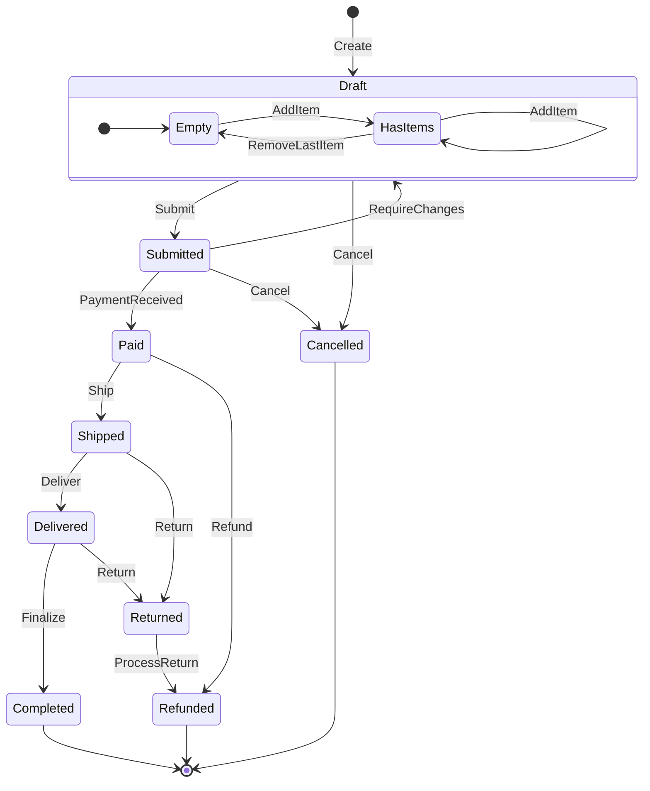
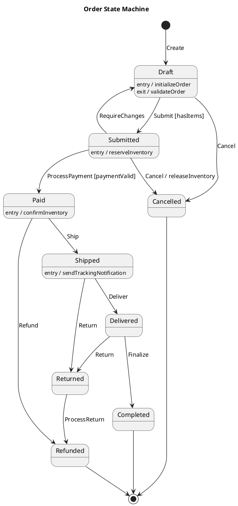

# State Machine Design Skill

## When to Use This Skill

Use this skill when:

- **State Machine Design tasks** - Working on statechart and state machine modeling for lifecycle and behavior specification
- **Planning or design** - Need guidance on State Machine Design approaches
- **Best practices** - Want to follow established patterns and standards

## Overview

Design finite state machines and statecharts for modeling entity lifecycles, workflows, and system behavior.

## Documentation-First Approach

Before designing state machines:

1. **Verify implementation patterns** via MCP servers (context7 for XState, etc.)
2. **Base all guidance on Harel statechart semantics**

## State Machine Concepts

### Core Elements

| Element | Description | Example |
|---------|-------------|---------|
| State | Condition the system can be in | `Draft`, `Submitted`, `Paid` |
| Transition | Change from one state to another | `Draft → Submitted` |
| Event | Trigger for a transition | `Submit`, `Pay`, `Cancel` |
| Guard | Condition that must be true | `[hasItems]`, `[isValid]` |
| Action | Side effect on transition | `sendNotification`, `updateDatabase` |
| Entry Action | Action when entering state | `onEnter: startTimer` |
| Exit Action | Action when leaving state | `onExit: stopTimer` |

### State Types

```typescript
type StateType =
  | 'initial'    // Starting state (filled circle)
  | 'normal'     // Regular state
  | 'final'      // End state (circle with border)
  | 'composite'  // Contains sub-states
  | 'parallel'   // Concurrent regions
  | 'history'    // Remember last sub-state
  | 'choice';    // Decision point
```

## State Machine Notation

### Mermaid Syntax



### PlantUML Syntax



## TypeScript Implementation Patterns

### Transition Map Pattern

Simple, declarative — good for machines with no side effects in the transition logic itself.

```typescript
const OrderStatus = {
  Draft: 'draft',
  Submitted: 'submitted',
  Paid: 'paid',
  Shipped: 'shipped',
  Delivered: 'delivered',
  Completed: 'completed',
  Cancelled: 'cancelled',
  Returned: 'returned',
  Refunded: 'refunded',
} as const;

type OrderStatus = (typeof OrderStatus)[keyof typeof OrderStatus];

const OrderEvent = {
  Submit: 'submit',
  Cancel: 'cancel',
  Pay: 'pay',
  RequireChanges: 'requireChanges',
  Ship: 'ship',
  Refund: 'refund',
  Deliver: 'deliver',
  Return: 'return',
  Finalize: 'finalize',
  ProcessReturn: 'processReturn',
} as const;

type OrderEvent = (typeof OrderEvent)[keyof typeof OrderEvent];

const transitions: Record<string, OrderStatus> = {
  [`${OrderStatus.Draft}:${OrderEvent.Submit}`]: OrderStatus.Submitted,
  [`${OrderStatus.Draft}:${OrderEvent.Cancel}`]: OrderStatus.Cancelled,
  [`${OrderStatus.Submitted}:${OrderEvent.Pay}`]: OrderStatus.Paid,
  [`${OrderStatus.Submitted}:${OrderEvent.Cancel}`]: OrderStatus.Cancelled,
  [`${OrderStatus.Submitted}:${OrderEvent.RequireChanges}`]: OrderStatus.Draft,
  [`${OrderStatus.Paid}:${OrderEvent.Ship}`]: OrderStatus.Shipped,
  [`${OrderStatus.Paid}:${OrderEvent.Refund}`]: OrderStatus.Refunded,
  [`${OrderStatus.Shipped}:${OrderEvent.Deliver}`]: OrderStatus.Delivered,
  [`${OrderStatus.Shipped}:${OrderEvent.Return}`]: OrderStatus.Returned,
  [`${OrderStatus.Delivered}:${OrderEvent.Finalize}`]: OrderStatus.Completed,
  [`${OrderStatus.Delivered}:${OrderEvent.Return}`]: OrderStatus.Returned,
  [`${OrderStatus.Returned}:${OrderEvent.ProcessReturn}`]: OrderStatus.Refunded,
};

function transition(current: OrderStatus, event: OrderEvent): OrderStatus {
  const next = transitions[`${current}:${event}`];
  if (!next) {
    throw new Error(`Cannot ${event} order in ${current} status`);
  }
  return next;
}
```

### XState Pattern

Full statechart implementation with context, guards, actions, and services.

```typescript
import { createMachine, assign } from 'xstate';

interface OrderContext {
  items: LineItem[];
  customerId: string;
  paymentId?: string;
  trackingNumber?: string;
}

type OrderEvent =
  | { type: 'ADD_ITEM'; item: LineItem }
  | { type: 'REMOVE_ITEM'; itemId: string }
  | { type: 'SUBMIT' }
  | { type: 'PAY'; paymentId: string }
  | { type: 'CANCEL' }
  | { type: 'SHIP'; trackingNumber: string }
  | { type: 'DELIVER' }
  | { type: 'RETURN' }
  | { type: 'REFUND' };

const orderMachine = createMachine({
  id: 'order',
  initial: 'draft',
  context: {
    items: [],
    customerId: '',
  } as OrderContext,

  states: {
    draft: {
      entry: 'initializeOrder',
      on: {
        ADD_ITEM: {
          actions: assign({
            items: ({ context, event }) => [...context.items, event.item],
          }),
        },
        REMOVE_ITEM: {
          actions: assign({
            items: ({ context, event }) =>
              context.items.filter(i => i.id !== event.itemId),
          }),
        },
        SUBMIT: {
          target: 'submitted',
          guard: 'hasItems',
        },
        CANCEL: 'cancelled',
      },
    },

    submitted: {
      entry: 'reserveInventory',
      exit: 'onSubmittedExit',
      on: {
        PAY: {
          target: 'paid',
          guard: 'paymentValid',
          actions: assign({
            paymentId: ({ event }) => event.paymentId,
          }),
        },
        CANCEL: {
          target: 'cancelled',
          actions: 'releaseInventory',
        },
      },
    },

    paid: {
      entry: 'confirmInventory',
      on: {
        SHIP: {
          target: 'shipped',
          actions: assign({
            trackingNumber: ({ event }) => event.trackingNumber,
          }),
        },
        REFUND: 'refunded',
      },
    },

    shipped: {
      entry: 'sendTrackingNotification',
      on: {
        DELIVER: 'delivered',
        RETURN: 'returned',
      },
    },

    delivered: {
      on: {
        RETURN: 'returned',
      },
      after: {
        '14d': 'completed',
      },
    },

    returned: {
      on: {
        REFUND: 'refunded',
      },
    },

    completed: { type: 'final' },
    cancelled: { type: 'final' },
    refunded: { type: 'final' },
  },
}, {
  guards: {
    hasItems: ({ context }) => context.items.length > 0,
    paymentValid: ({ event }) => event.type === 'PAY' && !!event.paymentId,
  },
  actions: {
    initializeOrder: () => console.log('Order initialized'),
    reserveInventory: ({ context }) =>
      console.log(`Reserving ${context.items.length} items`),
    confirmInventory: () => console.log('Inventory confirmed'),
    releaseInventory: () => console.log('Inventory released'),
    sendTrackingNotification: ({ context }) =>
      console.log(`Tracking: ${context.trackingNumber}`),
  },
});
```

## Testing State Machines

### What to Test

| Category | What to Verify |
|----------|---------------|
| **Happy paths** | Each valid transition produces correct next state |
| **Invalid transitions** | Rejected events in wrong states throw/return errors |
| **Guards** | Transitions blocked when guard conditions are false |
| **Actions** | Entry, exit, and transition actions fire correctly |
| **Context** | State context is updated correctly on transitions |
| **Terminal states** | Final states accept no further transitions |
| **Full paths** | End-to-end flows through the entire lifecycle |

### Testing the Transition Map Pattern

```typescript
import { describe, it, expect } from 'vitest';

describe('order state machine', () => {
  // Happy path transitions
  describe('valid transitions', () => {
    it.each([
      ['draft', 'submit', 'submitted'],
      ['draft', 'cancel', 'cancelled'],
      ['submitted', 'pay', 'paid'],
      ['submitted', 'cancel', 'cancelled'],
      ['submitted', 'requireChanges', 'draft'],
      ['paid', 'ship', 'shipped'],
      ['paid', 'refund', 'refunded'],
      ['shipped', 'deliver', 'delivered'],
      ['shipped', 'return', 'returned'],
      ['delivered', 'finalize', 'completed'],
      ['delivered', 'return', 'returned'],
      ['returned', 'processReturn', 'refunded'],
    ] as const)('%s + %s → %s', (from, event, expected) => {
      expect(transition(from, event)).toBe(expected);
    });
  });

  // Invalid transitions
  describe('rejected transitions', () => {
    it.each([
      ['draft', 'pay'],
      ['draft', 'ship'],
      ['submitted', 'ship'],
      ['paid', 'cancel'],
      ['completed', 'cancel'],
      ['cancelled', 'submit'],
      ['refunded', 'refund'],
    ] as const)('%s + %s → throws', (from, event) => {
      expect(() => transition(from, event)).toThrow();
    });
  });

  // Full lifecycle paths
  describe('end-to-end paths', () => {
    it('happy path: draft → completed', () => {
      let status: OrderStatus = 'draft';
      for (const event of ['submit', 'pay', 'ship', 'deliver', 'finalize'] as const) {
        status = transition(status, event);
      }
      expect(status).toBe('completed');
    });

    it('return path: draft → refunded', () => {
      let status: OrderStatus = 'draft';
      for (const event of ['submit', 'pay', 'ship', 'return', 'processReturn'] as const) {
        status = transition(status, event);
      }
      expect(status).toBe('refunded');
    });

    it('cancellation from submitted', () => {
      let status: OrderStatus = 'draft';
      status = transition(status, 'submit');
      status = transition(status, 'cancel');
      expect(status).toBe('cancelled');
    });
  });

  // Terminal states accept nothing
  describe('terminal states', () => {
    const terminalStates: OrderStatus[] = ['completed', 'cancelled', 'refunded'];
    const allEvents = Object.values(OrderEvent);

    for (const state of terminalStates) {
      it(`${state} rejects all events`, () => {
        for (const event of allEvents) {
          expect(() => transition(state, event)).toThrow();
        }
      });
    }
  });
});
```

### Testing XState Machines

```typescript
import { describe, it, expect, vi } from 'vitest';
import { createActor } from 'xstate';

describe('order machine (XState)', () => {
  function createOrderActor(context?: Partial<OrderContext>) {
    return createActor(orderMachine, {
      input: context,
    });
  }

  // Snapshot testing: verify state after events
  describe('transitions', () => {
    it('submits when items exist', () => {
      const actor = createOrderActor();
      actor.start();

      actor.send({ type: 'ADD_ITEM', item: { id: '1', name: 'Widget', qty: 1 } });
      actor.send({ type: 'SUBMIT' });

      expect(actor.getSnapshot().value).toBe('submitted');
      expect(actor.getSnapshot().context.items).toHaveLength(1);
    });

    it('blocks submit without items (guard)', () => {
      const actor = createOrderActor();
      actor.start();

      actor.send({ type: 'SUBMIT' });

      expect(actor.getSnapshot().value).toBe('draft');
    });
  });

  // Guard testing
  describe('guards', () => {
    it('blocks payment without paymentId', () => {
      const actor = createOrderActor();
      actor.start();

      actor.send({ type: 'ADD_ITEM', item: { id: '1', name: 'Widget', qty: 1 } });
      actor.send({ type: 'SUBMIT' });
      actor.send({ type: 'PAY', paymentId: '' });

      expect(actor.getSnapshot().value).toBe('submitted');
    });
  });

  // Action testing: verify side effects
  describe('actions', () => {
    it('calls reserveInventory on entering submitted', () => {
      const reserveInventory = vi.fn();

      const testMachine = orderMachine.provide({
        actions: { reserveInventory },
      });

      const actor = createActor(testMachine);
      actor.start();

      actor.send({ type: 'ADD_ITEM', item: { id: '1', name: 'Widget', qty: 1 } });
      actor.send({ type: 'SUBMIT' });

      expect(reserveInventory).toHaveBeenCalledOnce();
    });
  });

  // Context mutation testing
  describe('context updates', () => {
    it('stores trackingNumber on ship', () => {
      const actor = createOrderActor();
      actor.start();

      actor.send({ type: 'ADD_ITEM', item: { id: '1', name: 'Widget', qty: 1 } });
      actor.send({ type: 'SUBMIT' });
      actor.send({ type: 'PAY', paymentId: 'pay_123' });
      actor.send({ type: 'SHIP', trackingNumber: 'TRACK_456' });

      expect(actor.getSnapshot().context.trackingNumber).toBe('TRACK_456');
    });
  });
});
```

### Testing Strategies Checklist

1. **Table-driven tests** for transition maps — enumerate all valid/invalid pairs
2. **Guard isolation** — test each guard predicate returns correct boolean independently
3. **Action spies** — use `machine.provide({ actions })` to inject mocks and verify calls
4. **Context snapshots** — assert context shape after each transition
5. **Path coverage** — test every reachable path from initial to each final state
6. **Exhaustive invalid transitions** — for every `(state, event)` pair not in the valid set, assert rejection
7. **Model-based testing** — use `@xstate/test` to auto-generate test paths from the machine definition

## Design Best Practices

### State Design Guidelines

1. **Name states as conditions**: `Submitted` not `Submit`
2. **Name events as commands**: `Submit` not `Submitted`
3. **Use guards for conditional transitions**
4. **Keep states atomic**: One responsibility per state
5. **Document entry/exit actions**
6. **Consider terminal states** (final states)

### Common Patterns

| Pattern | Use Case |
|---------|----------|
| Linear | Simple sequential flow |
| Choice | Conditional branching |
| Parallel | Concurrent activities |
| Hierarchical | Complex nested states |
| History | Resume from last state |

## Workflow

When designing state machines:

1. **Identify entity**: What has the lifecycle?
2. **List states**: What conditions can it be in?
3. **Define events**: What triggers state changes?
4. **Map transitions**: State + Event → New State
5. **Add guards**: What conditions must be true?
6. **Define actions**: What happens on transitions?
7. **Draw diagram**: Visualize for review
8. **Implement**: Choose appropriate pattern
9. **Test**: Verify all transitions, guards, and paths

---

**Last Updated:** 2026-03-25
